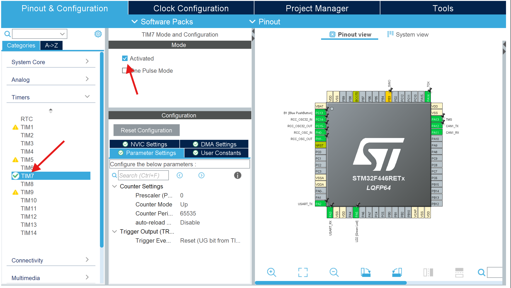
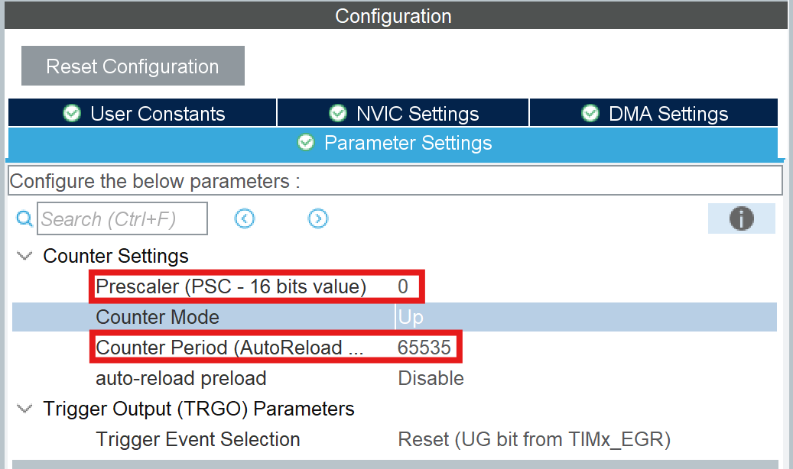
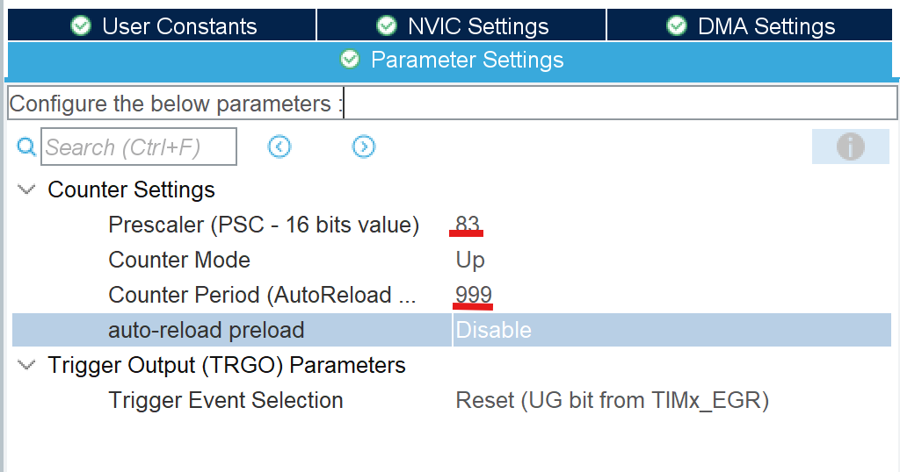
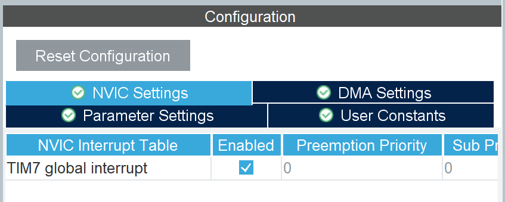

# Timer

## Timerとはなんぞや

Timerとはマイコン内部の時間を計測したり、一定周期で処理を行うための機能です。

## Timerでできること

- PWMを動かす
- エンコーダー（モーターの回転数を見るための装置）を使う
- 一定間隔で処理を行える（Timer割り込みと言う）

## PIN設定

それでは実際にPIN設定をしていきましょう。TimerのPIN設定はすこしややこしいです。
TimerのPIN設定では用途別に回路図が必要かどうかが変わります。PWM、エンコーダーは必要ですが、単純な割り込みなら必要ありません。

### Timer割り込み

Timer割り込みは回路図を必要としないので適当なところのPINをTimerに設定しましょう。ですが今回はTimer7で行くので、PINを設定する必要はありません。どうしてかというと、Timer7はTimerのなかで唯一の内部クロックで、内部クロックは外に電流を流さないので、設定する必要がありません。

設定できたら、左にある**Timers**をクリックし、その中のTIM7（PINを設定したTIM）を押します。そうすると下の画像のようにチェックボックスが出てきたと思います。その中の**Activated**を押します。

ここからが本番です。今押したときに出てきた下の欄を見てください。下の画像のようなものがあると思います。その中の値をこれから変えていきます。

### Prescaler・Counter Period

最初の関門PrescalerとCounter Periodです。これは何だという疑問はまず置いておいて、先にTimerのカウント仕様について話します。Timerで1秒間に割り込まれる回数はClock Configuration(クロックコンフィギュレーション)で設定したTimer Clocksの値によって変わります。1番の資料で見せたものでは84MHzになっていたと思います。このままだと1秒間に84,000,000回割り込まれてしまいます。これでは多すぎてエラーが出ます。

ここで登場するのがPrescalerとCounter Periodです。1秒間の割り込み回数は以下のような式で表されます。

**回数 = Timer Clocks ÷ ((Prescaler + 1) × (Counter Period + 1))**

となります。また、Counter Periodはカウント、duty比の最大値となります。そのため、

**1カウントにかかる時間 = Timer Clocks ÷ (Prescaler + 1)**

となります。この時間を1マイクロ秒にしたいので、Prescalerの値は、83になります。また、1秒間の割り込み回数は1000回（1kHz）にしたいので、Counter Periodは999になります。

それができたら最後にNVICsettingにあるチェックボックスを押します。これは割り込みを発生させるかどうか決めるものです。そのため、TIM割り込みを使うときは必ずチェックを入れておく必要があります。

これでPIN設定は完了です。