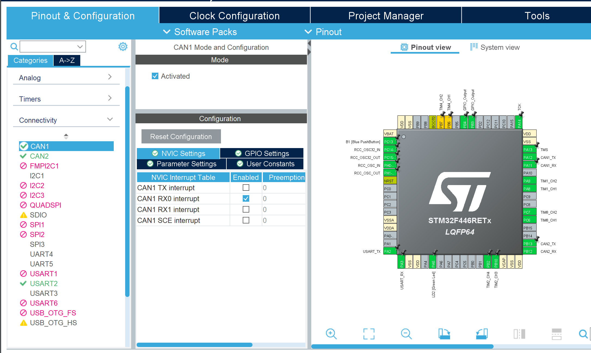
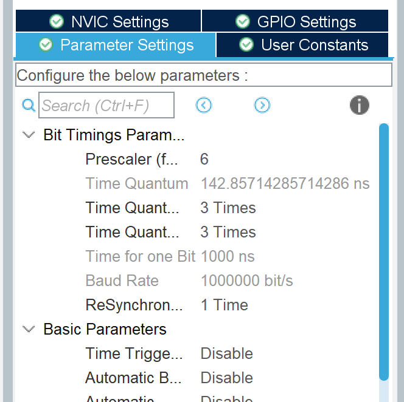

# CAN通信

## CAN通信とはなんぞや

CAN通信とは、ノイズに強い通信の方式で、主にモーターとマイコンの通信、マイコンとPCの通信で使われます。　　
ロボコンをするうえで一番お世話になるのがこのCAN通信だと思います。  
CAN通信は、例えるなら教室での会話です。  
教室でみんながいろんな話題で話しているとします。CAN通信で送受信される情報が、この話題です。1本の線で、様々な情報を送受信します。  
この時、全員がそれぞれの会話が聞こえていると考えてください。しかし、自分は必要な会話しか聞いていませんよね。CAN通信も同じように必要な情報をフィルターを使って選別しています。  

## フィルター設定

CAN通信を使うときは、フィルター設定をしないといけません。  
フィルター設定は関数一覧のところにのっているのでそれをコピペしてOKです。  

CANのフィルター設定
```c
void CAN_Init(){
	CAN_FilterTypeDef can1_filter, can2_filter;
	can1_filter.FilterIdHigh         = 0 << 5; //highとlowでor条件で通す
	can1_filter.FilterIdLow          = 0 << 5; //論理積の結果がidと一緒なら通す
	can1_filter.FilterMaskIdHigh     = 0 << 5;
	can1_filter.FilterMaskIdLow      = 0 << 5; //filtermaskで論理積
	can1_filter.FilterScale          = CAN_FILTERSCALE_16BIT;
	can1_filter.FilterFIFOAssignment = CAN_FILTER_FIFO0;
	can1_filter.FilterBank           = 0;
	can1_filter.FilterMode           = CAN_FILTERMODE_IDMASK;
	can1_filter.SlaveStartFilterBank = 14;
	can1_filter.FilterActivation     = ENABLE;
	HAL_CAN_Start(&hcan1);
	HAL_CAN_ConfigFilter(&hcan1, &can1_filter);
	HAL_CAN_ActivateNotification(&hcan1, CAN_IT_RX_FIFO0_MSG_PENDING);

	can2_filter.FilterIdHigh         = 0 << 5;
	can2_filter.FilterIdLow          = 0 << 5;
	can2_filter.FilterMaskIdHigh     = 0 << 5;
	can2_filter.FilterMaskIdLow      = 0 << 5;
	can2_filter.FilterScale          = CAN_FILTERSCALE_16BIT;
	can2_filter.FilterFIFOAssignment = CAN_FILTER_FIFO0;
	can2_filter.FilterBank           = 14;
	can2_filter.FilterMode           = CAN_FILTERMODE_IDMASK;
	can2_filter.SlaveStartFilterBank = 14;
	can2_filter.FilterActivation     = ENABLE;
	HAL_CAN_Start(&hcan2);
	HAL_CAN_ConfigFilter(&hcan2, &can2_filter);
	HAL_CAN_ActivateNotification(&hcan2, CAN_IT_RX_FIFO0_MSG_PENDING);
}
```

これを、BEGIN 0にかき、BEGIN 2で関数を実行する必要があります。  

## CAN1, CAN2について

CAN通信には、送受信するところが二つあります。CAN1ではPCとの送受信、CAN2ではモーターとの送受信をします。

## PIN設定

いつものようにCAN1とCAN2のPINを設定します。  
それができたら、左の所からCAN1,CAN2を探して、それを押してActivatedにチェックを入れます。  
そうしたらNVIC Settingsで**CAN1 RX0 interrupt**にチェックを入れます。  




それができたら、Prescalerを6、Time Quanta~を3にしましょう。  
そうすれば、下の二つのあたいが美しくなると思います。  



これでCANのPIN設定はOKです。

## コーディング

CAN通信は基本的にTimerなどと組み合わせて使います。

1.CANの送信
```c
HAL_CAN_AddTxMessage(&hcan, &TxHeader, TxData, &TxMailbox);
```
2.CANの受信(受信を実行しつつ受け取れたかどうか確認)
```c
if(HAL_CAN_GetRxMessage(hcan, CAN_RX_FIFO0, &RxHeader, RxData) != HAL_OK) return;
```
3.CAN割り込み
```c
void HAL_CAN_RxFifo0MsgPendingCallback(CAN_HandleTypeDef *hcan)
```

モーターを回すだけならCANの送信だけで事足ります。  
しかし、モーターを回すときにモーターからの情報をもとに計算したり、PCからの指令で動かしたりするので、後々CAN割り込み（CANが来た時に割り込む）も使うようになると思います。  
また、CANの送受信をするときには、下のコードのようにHeader、Mailbox、TxData（送信する値）を定義する必要があります。  
Mailboxは、送受信されたデータを保管しておく場所のことで、CAN1,CAN2の内部構造で合計28個の部屋を持っています。  
なのでそれぞれ14個の部屋を持っていることになります。  
また、それぞれで持つことのできるMailboxの数は3つずつなので、1フレームでの送信、受信の回数は3回までにしましょう。

```c
uint8_t TxData[8];
CAN_TxHeaderTypeDef TxHeader;
uint32_t TxMailbox;

for(int i=0;i<4;i++){
    TxData[2*i]     = current[i] >> 8;
    TxData[2*i + 1] = current[i] & 255;
}

TxHeader.StdId = 0x200;
TxHeader.RTR   = CAN_RTR_DATA;
TxHeader.IDE   = CAN_ID_STD;
TxHeader.DLC   = 8;

HAL_CAN_AddTxMessage(&hcan2, &TxHeader, TxData, &TxMailbox);
```

Txが送信、Rxが受信です。  
上のコードは、CANを送信するものなので、これを自作関数化してTimer割り込みで実行します。  