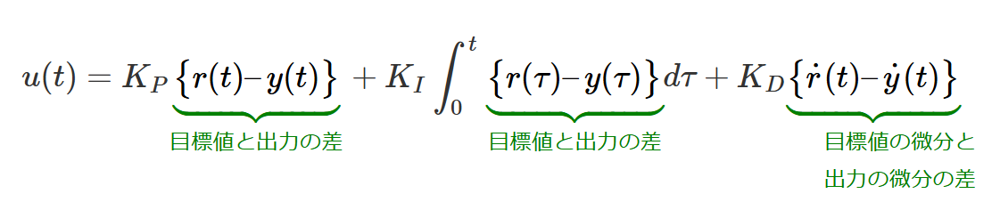

# モーターを回すには

## モーターの種類について

ロボコンで使うモーターにはいくつか種類があります。  
- ロボマスモーター
- マブチモーター
- DCモーター
などです。

### ロボマスモーター

この中で一番使うのがロボマスモーターです。  
このモーターの特徴は、**小型だけど強い・丈夫**　なところです。  
CAN通信にも対応しており、モータードライバーという部品1つで、モーターの回転数、角度、1分間の回転数（rpm）を調べることができるため、位置制御や速度制御を比較的簡単に行うことができます。 
回転方向を電流値の＋・－で変えることもできます。

### マブチモーター

次にマブチモーターです。  
マブチモーターの特徴は、**ロボマスモーターよりも強い・安い**　というところです。  
マブチモーターはそれの会社がいっぱい配っているため、安いという表記にしています。  
しかし、マブチモーターはサイズが大きいため使いどころが限られます。  
また、ロボマスがモータードライバー1つでやっていたことをいろいろな部品を使ってやらないといけません。  
しかも、＋・－で回転方向を変えることができません。  
ちなみに筆者はマブチモーターアンチです。  

### DCモーター

最後にDCモーターです。  
これは一番小さいモーターで、力も一番弱いです。（まあロボマスより少し弱いくらいですが）  
これくらいしか特徴がないです。

## 必要なもの

さあここまで勉強してきた諸君、モーターを回すのに必要なものを考えてみよう。（PCと通信もする）  

必要なものはこいつらだ(*'▽')

- CANid
- 電流値の送信
- 目標値の受信
- 状況によって位置制御・速度制御・PID制御
  
これらの流れとしては、

- PCのCANidの所からCANが来たら目標値（目標の位置や速度）を受信する → 
- モーターから受信した情報で実際の位置や速度を計算 → 
- 目標値から現在値の差分を使ってPID制御 →
- PID制御で出した電流値をモーターに送信

こんな感じです。  

## PCのCANidの所からCANが来たら目標値（目標の位置や速度）を受信する

CANidは高レイヤーと話し合って決める必要があります。（自由に決めれます）  
CANid　→　0x001など  
これがCANidですが、0xが16進数という意味を持っています。
idの取得をするコードは関数一覧に載せています。  
それを使ってidという変数にCANidを代入し、それが自分たちの決めたidと等しい場合に、目標値の変数にRxDataを代入します。  

これらを行う前に、CAN1とCAN2のどちらからCANが来ているのかもif文を使って分けておく必要があります。  

## モーターから受信した情報で実際の位置や速度を計算

ロボマスモーターから情報を受信するときには、気を付けなければならないことがあります。それはRxDataに受信されている情報が、indexによって異なることです。  
ロボマスから情報を受信すると書きましたが、基本はモーターから送られてくるのではなく、モータードライバーから情報が送られてきます。  
モータードライバーはモーターの回転数、角度、1分間の回転数（rpm）などの情報をすべて送ってくるため、必要な情報を抜き出して使う必要があります。  

① 角度（Rotor Angle）

- データ：index 0～1
- 範囲：0 ～ 8191
- 意味：モーターの現在の回転位置（1周＝8192カウント）

ポイント
- 1周すると0に戻る（オーバーフロー）。位置制御では「周回数」を自分で管理する必要あり

② 回転速度（RPM）

- データ：index 2～3
- 単位：rpm（回転/分）
- 意味：正 → 正回転・負 → 逆回転

③ トルク電流（Current）

- データ：index 4～5
- 意味：モーターに流れている電流

④ 温度（Temperature）
- データ：index 6
- 単位：℃
- 用途　→　過熱防止・異常検知

まとめると

- RxData[0]　角度　上位バイト   uint8_t  
- RxData[1]　角度　下位バイト   uint8_t	 
- RxData[2]　速度　上位バイト   int16_t	 
- RxData[3]　速度　下位バイト   int16_t	 
- RxData[4]　電流　上位バイト   int16_t	 
- RxData[5]　電流　下位バイト   int16_t	 
- RxData[6]　温度　　　　　　 uint8_t  

こんな感じでデータが受信されます。なので、それを下のようなコードで変数に代入します。（コードの意味は調べよう！）

```c
int16_t rpm = (int16_t)(RxData[2] << 8 | RxData[3]);
```

## 目標値から現在値の差分を使ってPID制御

目標値から現在値の差文を出すのは容易だと思います。  
しかし、PID制御という言葉を聞くのは初めてだと思います。  
PID制御とは、目標値と現在値の差をもとに、比例・積分・微分の3つの要素で値を調整する制御方式です。  


これがPID制御の式だよ。難しいからそんなに考えなくても大丈夫。
  
  
  
現在値を目標値に近づけるため、最初は比例でモーターに流す電流値を大きくしていきます。    
しかし、目標値を過ぎても、外部の影響で現在値が増減してしまいます。  
そこで、目標値と現在値の差文（積分値）を累積させ、それも計算に用いることで、値がずれても修正できるようにします。  
これがPI制御です。  

Dは使うこともありますが、なくてもある程度は支障がないのでPI制御を重点的にできるようにしていきましょう。  

PID制御の式はこのようになります。

```c
const float dt = 0.001;
error_now = target_posi[i] - now_position[i];
error_delta[i] = error_now[i] - error_last[i];

current[i] = (p_gain[i] * error_now) + (i_gain[i] * integral[i]) + (d_gain * error_delta[i]);

integral[i] += error_now * dt;
error_last[i] = error_now[i];
```

このPID制御の式はTimer割り込みに書きましょう。  
そして、各種gain（ゲイン）がコード内にあると思いますが、これを現在値がきれいに目標値に近づくようにするのも、低レイヤーの仕事の一つです。

## PID制御で出した電流値をモーターに送信

あとはCAN通信の時にやったCANの送信をするだけです。

## 練習問題

### 位置制御をしてみよう！

モータードライバーから角度の情報を読み取り、今いる位置を計算し、目標の位置との差文でPID制御をしてモーターを回せるようにしよう！  
これができたら立派な低レイヤーの仲間入りだ！