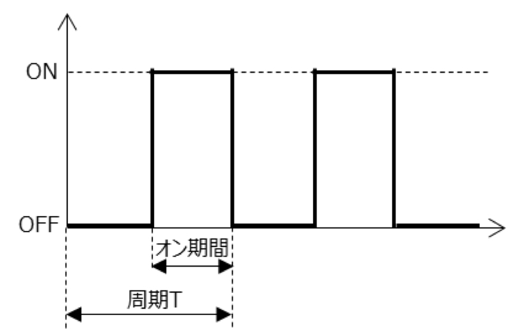
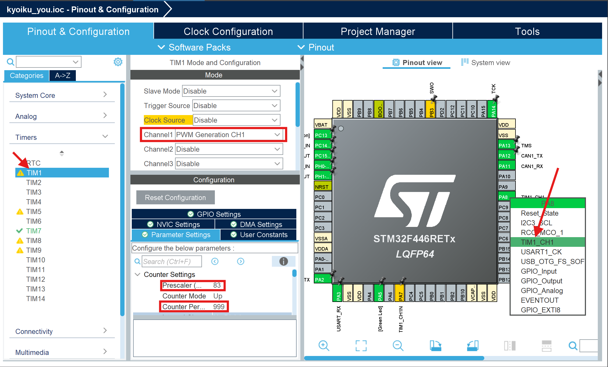

# PWM

## PWMとはなんぞや

PWMとはGPIOと違い、マックスの値から何％の強さの電流を流すか(duty比と言う)で制御する方式です。  
要するにONかOFFだけではなく出力の強さを変えられるということです。  
duty比を大きくするほど出力が強くなります。  



duty比イメージ画像

## PIN設定

まずはPIN設定です。  
PWMではTimerのPWMモードを使います。これは内部クロックでは使うことができません。  
そのため、まずはPINを選びましょう。今回はTIM1_CH1でやります。  
CHとはチャンネルのことで、それぞれ別のものと考えてください。  



上の画像のようにPINが設定をし、TIM1を選び、CHANNEL1の所を、**PWM Generation CH1**にします。  
CH1とCH1Nがあると思いますが、CH1が通常モードで、CH1Nは通常と逆向きの波形の電流を流すモードです。  
このNのついているモードは、TIM1とTIM8でのみ使うことができます。  
また、Counter Periodの値 + 1が、PWMでのduty比の最大値となります。  

## コーディング

最後にコーディングです。  
PWMで使うコードは下のようになっています。  

1.PWMの開始（TIM番号、 CH番号）
```c
HAL_TIM_PWM_Start(&htim, TIM_CHANNEL_?);
```

2.PWMのduty比変更(最初はアンダーバー2つ)
```c
__HAL_TIM_SET_COMPARE(&htim, TIM_CHANNEL_?, duty);
```

PWMの開始は、Timerのように自作関数化し、BEGIN 2で実行するようにしましょう。  

## 練習問題

### Timer割り込みを使い、PWMでマブチモーターを滑らかに回そう！

Timer割り込みの中にPWMのduty比を一定の量増減させるコードを書きましょう！  
0からMAXまで1秒で増加させ、0まで1秒で減少させましょう。  
できたら先輩に言って動かしてみよう！  