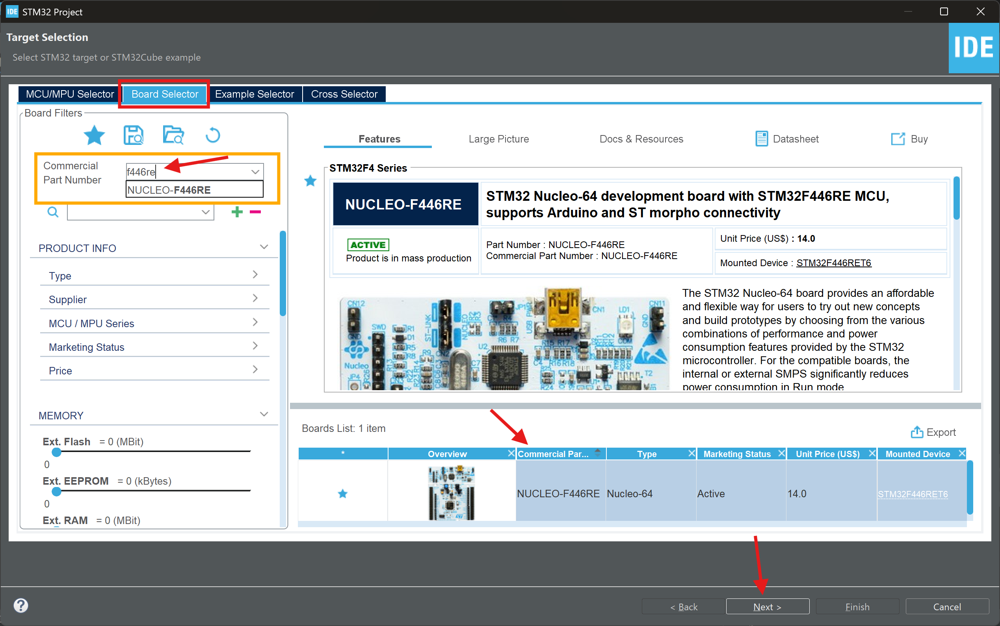
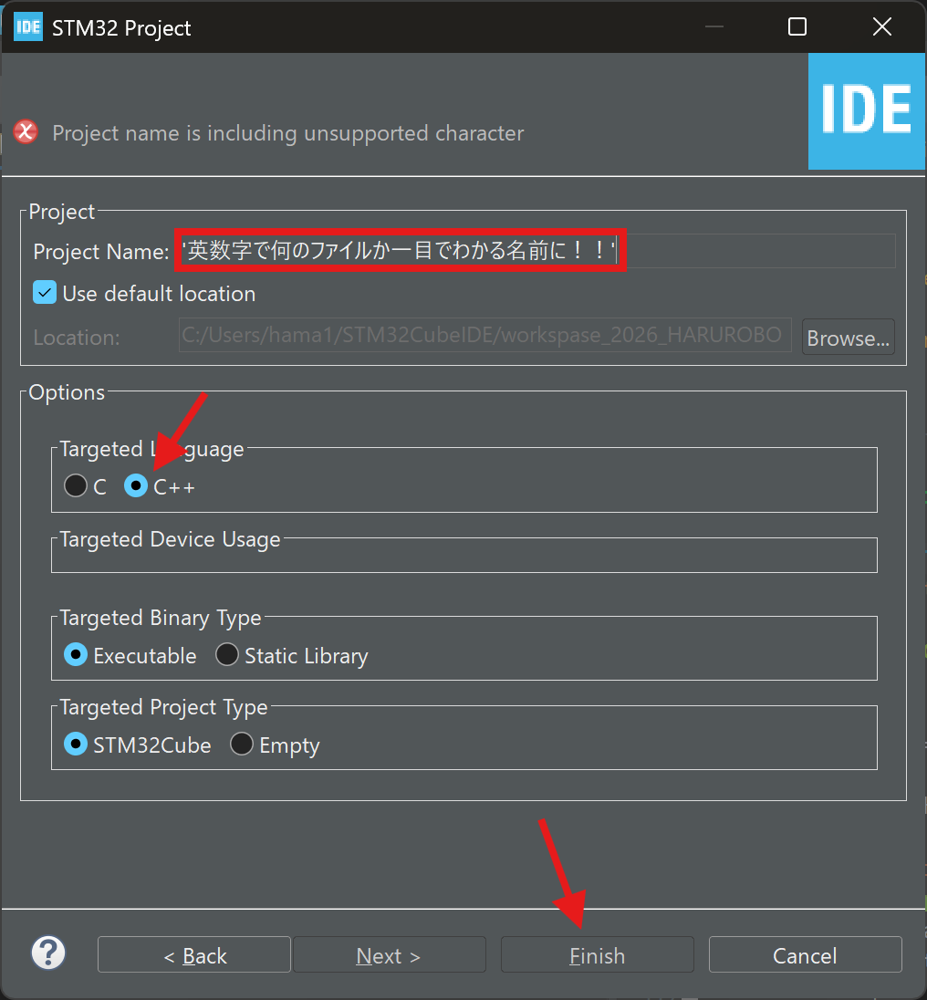
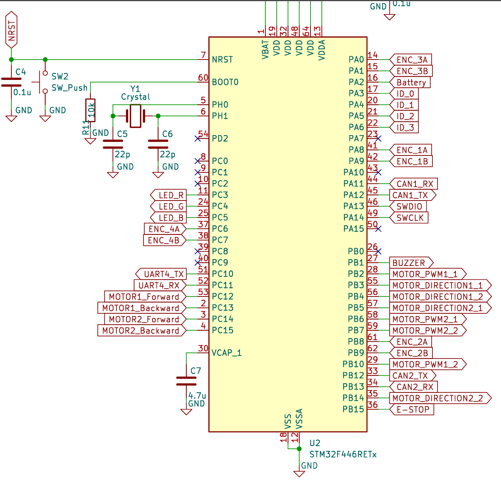
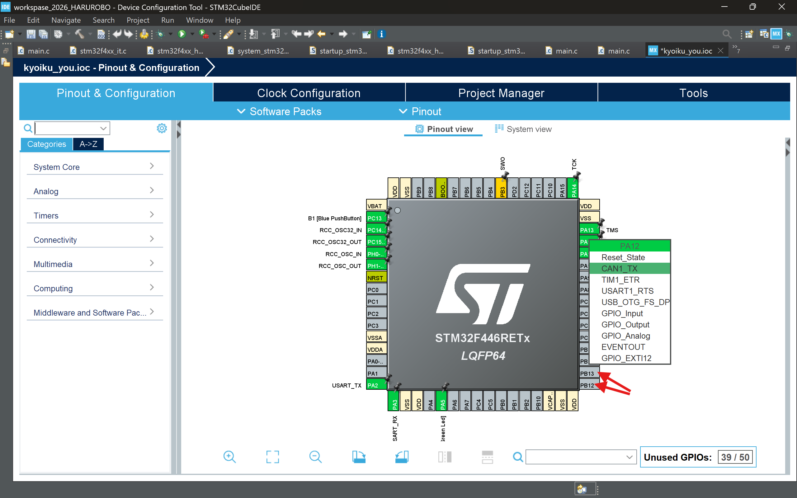
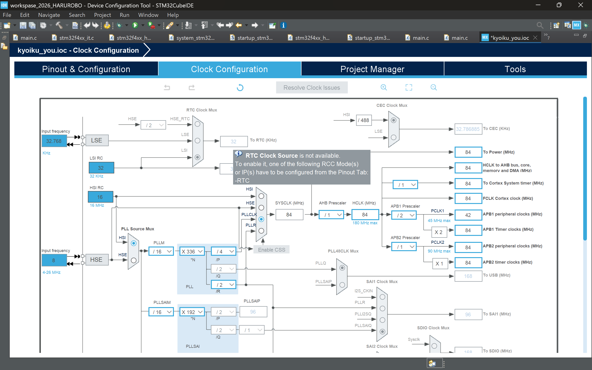
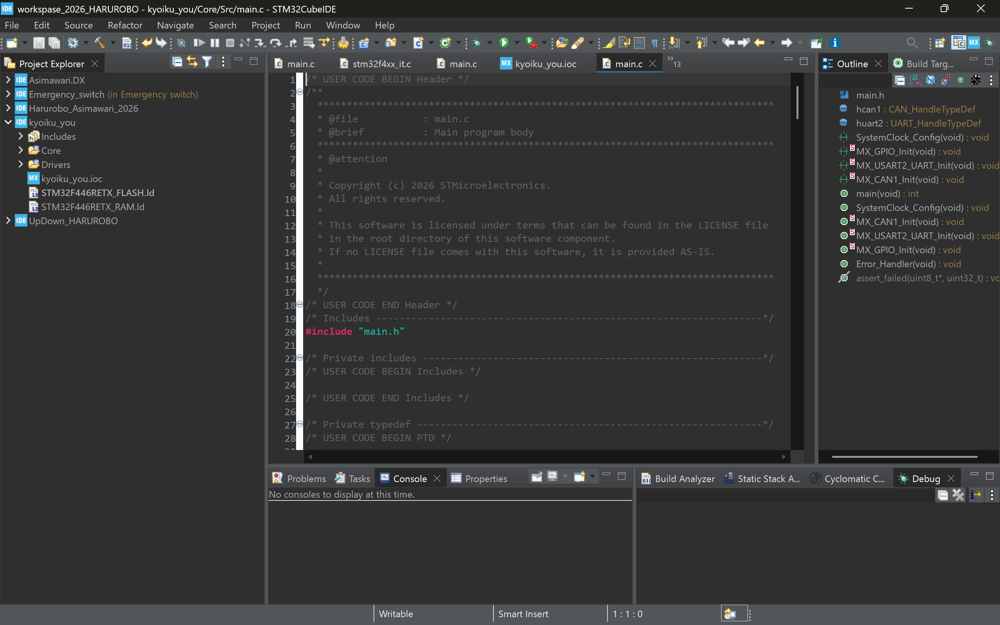
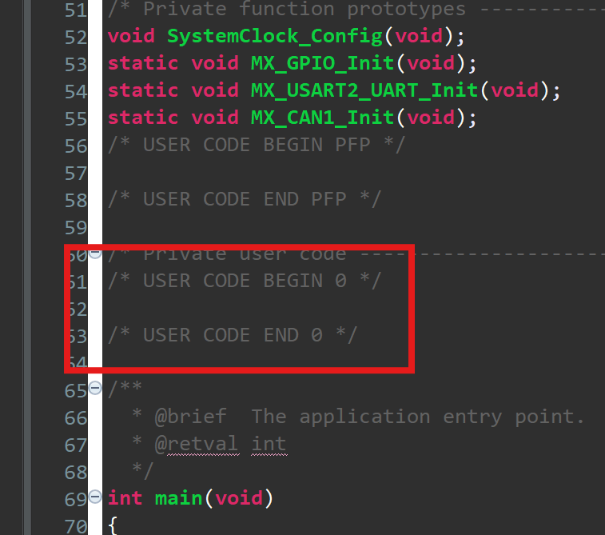

# 基礎知識

## 低レイヤー、高レイヤーって何？

Aチームの制御班は低レイヤーと高レイヤーの二つで作業を分担しています。
主に低レイヤーは基盤についているマイコンの制御、高レイヤーはPCとマイコンの通信やセンサーの制御などをします。今から書いていくのは低レイヤーの教育資料となります。

## STM32CubeIDE

低レイヤーのマイコン制御では主に**STM32CubeIDE**というものを用います。マイコンをよく見ると線みたいなのがいっぱい生えていると思います。それを**PIN**といい、STM32CubeIDEではこれのどこから何の信号を送るか、受け取るのか、受け取った後の情報を用いた計算、PCやモーターとの通信を制御します。制御の方法はたくさんあるので、後々解説します。
まずはこのSTM32CubeIDEをダウンロードしましょう。

[これを見てやってね(わからなくなったら先輩を頼ろう)](https://qiita.com/usashirou/items/65be086c28f7a6feac7d)

## STM32CubeIDEの基礎知識

STMがダウンロード出来たらここからがスタートです！プロジェクトを新しく作るときは**STM32project**を押します。また、C言語を勉強したことのないそこのあなた！STMではC言語を使ってコードを書くので、まずは下のリンクの苦しんで覚えるC言語で勉強をしよう！だいたい15章まで進んだらこの先に進めるようになると思います。がんばって！

[苦しんで覚えるC言語](https://9cguide.appspot.com/index.html)

コードを書く前にいろいろとしないといけないことがあります。
- ボード設定
- PIN設定
- Clock Configuration(クロックコンフィギュレーション)
などです。

### ①ボード設定

ボード設定では自分たちが使う基盤の種類を選ぶ必要があります。私たちがよく使うのが**NUCLEO‐F446RE**という種類の基盤です。図1の**Board Selector**を押し、f446eと入れると、右下に一つだけ基盤が出てくるので、それをクリックし、nextを押します。

図1

そのあと図2のようなものが出てくるので、英数字で**一目でわかるファイル名**にし、言語をC++にしたら、finishを押します。あとは何か聞かれたらyesを押します。そうしたら、ボード設定は完了です。

図2

### ②PIN設定

PIN設定は低レイヤーの仕事の中でも重要な方なので丁寧に解説していきます。これがわかれば基礎知識はある程度大丈夫だと思います。PIN設定ではどのPINでどの方式で電流(情報)を流すか設定します。そのため、まずは通信の方式などを軽く解説します。低レイヤーで使う通信方式などは以下のようになっています。

- **CAN**通信(一番使う)　→　PCやモータードライバーと通信する際に使う
- **GPIO**(モーターによっては使う)　→　電流を流すか流さないかで制御する
- **PWM**(モーターによっては使う)　→　マックスの値から何％の強さの電流を流すか(duty比と言う)で制御する
- **Timer**(ほぼ毎回使う)　→　一定の間隔で何かの処理をするときに使う
- **UART**(マジで使わん)　→　異なる機器同士の通信ができるが、CAN通信でいい。この教育資料では教えません

こんな感じです。

これらをどこのPINで行うかを設定します。実際では回路班の作る**回路図**と対応させてPIN設定をします。下の画像は去年の大会で用いた回路図です。これと対応したところに、自分が使う機能のPINを設定します。(矢印は無視してね)

 

上の図で言うとCAN1の所は**PA11**と**PA12**なのでそこをCAN1に設定します。使う機能のPINを設定した後に少しやることがあるのですが、今回は省略します。それぞれの方式を詳しく説明する際に一緒に説明します。

### ③Clock Configuration(クロックコンフィギュレーション)

ここでは流す電流の周波数を設定します。これに関しては詳しく知る必要はないです。基本下の画像のようになっていればOKです。

**HSI**と**HSE**の違いだけには触れておきます。HSIはマイコンの中にもとからついている**内部クロック**のことです。これはコストが低い分制度が少し落ちます。HSEは**外部クロック**で基盤に着けているときはこっちも使えます。基本は**内部クロックを用いる**のでHSIにしておく必要があります。

## コーディング

これらができたらついにコードを書くフェーズに移れます！コードを書くにはPIN設定を**Ctrl + s**で保存をしましょう。そうすればなんかのロードが始まってyesかnoかを聞かれるのですべてyesを押します。そうすると、こんな感じになったと思います。

今回は具体的なコードは書きませんがどこにどんなコードを書くのか、どのようにコードを書いていくのかをイメージしてもらおうと思います。まず、コードを書く場所ですが、下にスクロールすると**USER CODE BEGIN 0**と書いてある場所があると思います。

このような**USER CODE BEGIN～**から**USER CODE END～**までのスペースにコードを書きます。このスペースは0から4まであり、while文で書かれているところもあります(1個)。これらにはそれぞれ特徴があります。

- BEGIN 0 → ユーザーが独自に変数や関数を定義するところ
- BEGIN 1 → BEGIN 0で行う変数や関数の初期化の前に行いたい処理を書く(あんまり使わない)
- BEGIN 2 → TimerやPWMの開始をする
- BEGIN 3 → while文(無限ループ)の中に処理を書く、CANやTimerはあまりここには書かない
- BEGIN 4 → 関数を定義できるがあまり使わないので省略

また、STM32CubeIDEでは、HALライブラリというライブラリから独自の関数を持ってきて使います。それが結構覚えにくいのでほかの資料で一覧にしておきます。

こんな感じです。これらはやっていくうちに覚えるので、次はGPIO → PWM → CANの順番で解説していきます。お楽しみに～。

## 最後に

知っておくと便利なショートカットキーを一覧で載せておこうと思います。

- Ctrl + z → 巻き戻し
- Ctrl + s → 保存(作業の節目にこれを押すくせをつけよう)
- Ctrl + c → コピー
- Ctrl + v → ペースト、貼り付け
- Ctrl + x → 切り取り
- Ctrl + a → 全選択
- Ctrl + f → コード内の文字や単語の検索(詳しくは先輩に聞いてもいいし調べてもいいぞ！)