# 3Dプリンタを使おう！

## 3Dプリンタとは
自分たちが設計したデータをもとに、樹脂などの材料を層状に積み重ねて立体造形する機器。
ロボAの部室にはA1mini、FLASHFORGEがある。
ロボAでは樹脂のフィラメントを使って造形をしている。
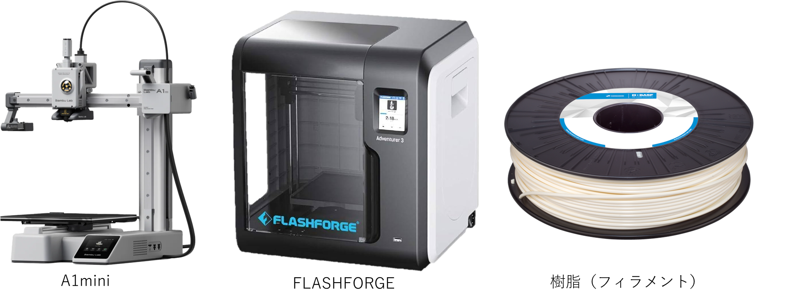

## 3Dプリンタへの道のり
実は3Dプリンタは直接SOLIDWORKSのデータを受け取ってくれない。
だから、3Dプリンタ用のデータに置き換える必要がある。

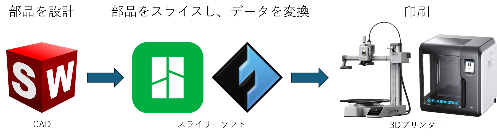
（スライスについては後述します。）

## CADデータの変換
SOLIDWORKSからスライサーソフトにデータを渡すとき、形式をSTLにしないといけない。
### STLで保存するやり方
左上の上書き保存の右の下矢印をクリック
指定保存をクリック
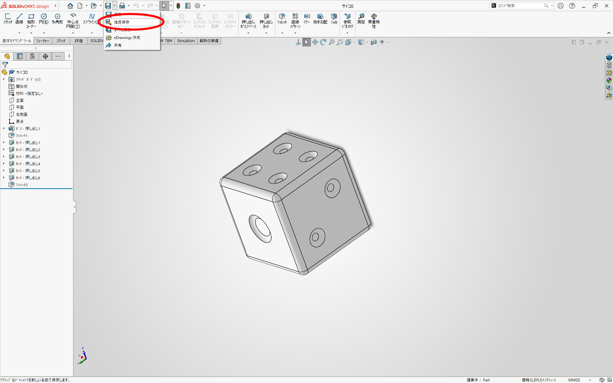
ファイルの種類からSTLを探し、クリックして保存
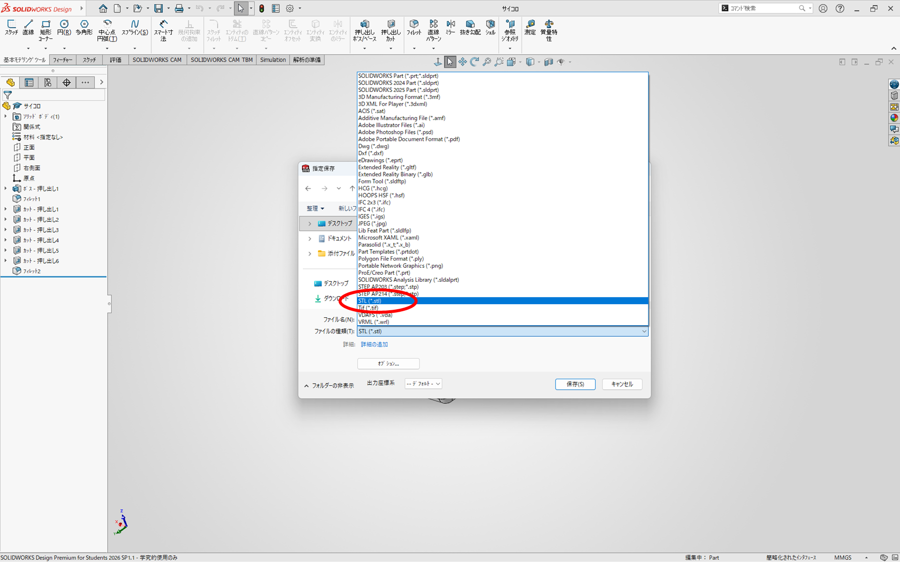

## 3Dプリンタの使い方（A1mini編）
A1miniはBambu Labの3Dプリンタのため、Bambuのスライサーソフトを使う。
Bambu Studio（Bambuのスライサーソフト）を開く
アイコン→
左上の準備をクリック
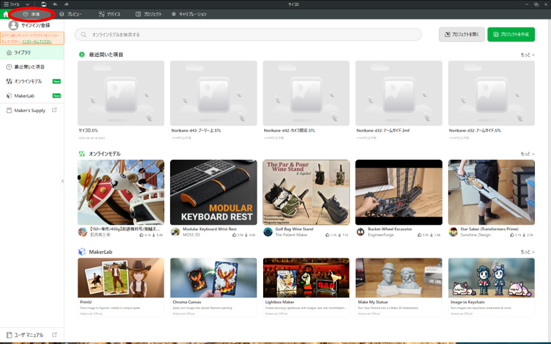
右の画面になったら<追加>をクリックし、部品を選択し、開く。
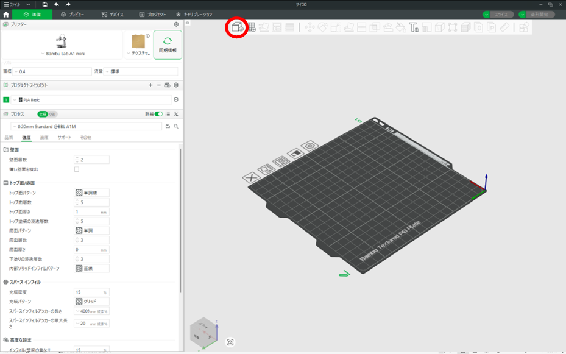

## 3Dプリンタ用語（壁面編）
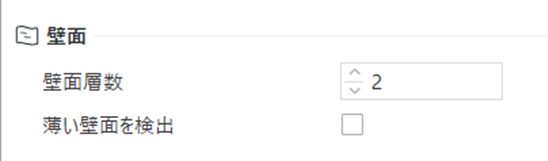

壁面とは造形物の外殻を形成する側面部分のこと。
壁面の数が多いほど強度が高くなるが、フィラメントがたくさん必要になる。
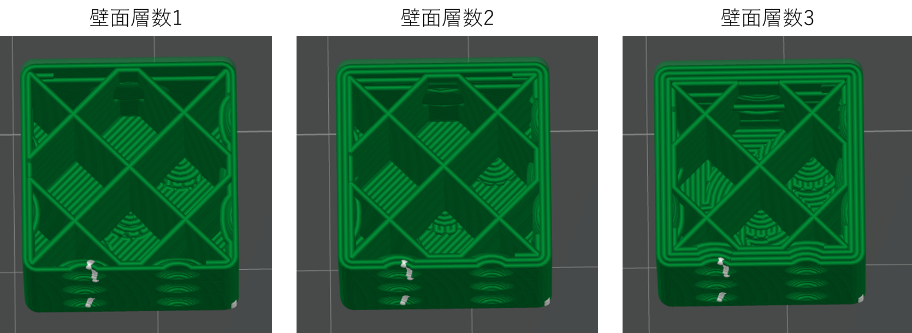
↑外側が厚くなってる！！！

## 3Dプリンタ用語（インフィル編）
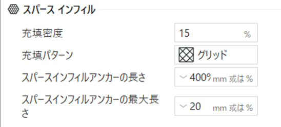

インフィルとは壁面の内側の中身のこと。いろいろな種類があり、密度を変更できる。
それぞれ特徴があり、基本的には早くて強いのでジャイロイドを使う。
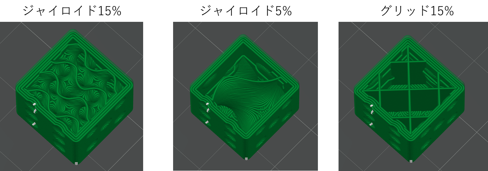
試作は密度を低くし無駄をなくし、本番は高い密度で強度を上げよう。

## 3Dプリンタ用語（サポート変）
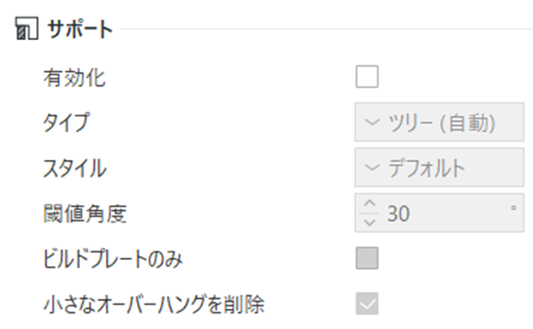

サポートとは浮いているところを支える役割をもつ。ツリーと通常の2種類があり、自分は大体ツリーを使う。
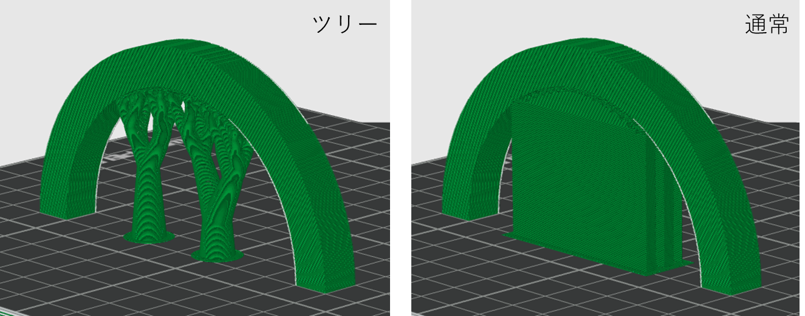
サポートは45°を下回ってからつく。サポートがついているとはがすときに本品も傷ついたりフィラメントの無駄だったりするので、このようなことをしてできるだけ無駄をなくそう。
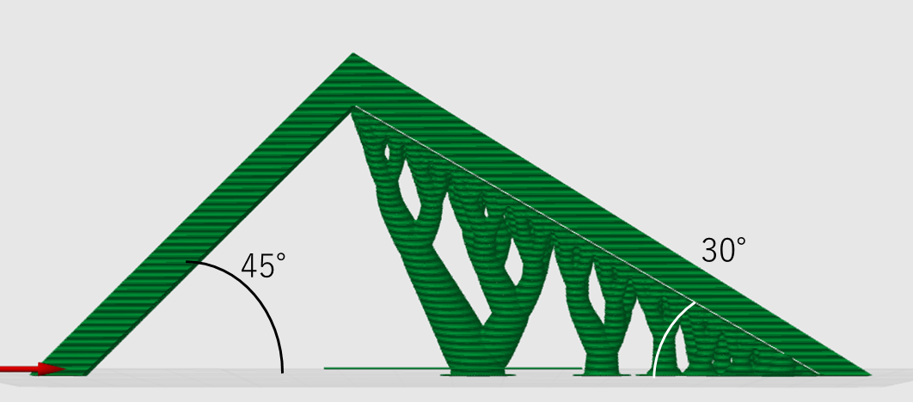

## A1mini よく使うコマンド
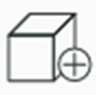部品を追加する。
サポートが少なくなるように自動で傾きを調整してくれる。
いい感じの配置になるように部品の位置を自動で調整してくれる。
傾きを手動で調整できる。

注意：自動調整が必ず正しいわけではないので、場合によっては手動でやろう！

## スライス&エクスポート（A1mini編）
スライスとはSTLのデータを3Dプリンタが造形するように層状に造形すること。
サポートやインフィル、壁面などができたら右上のスライスをクリック。
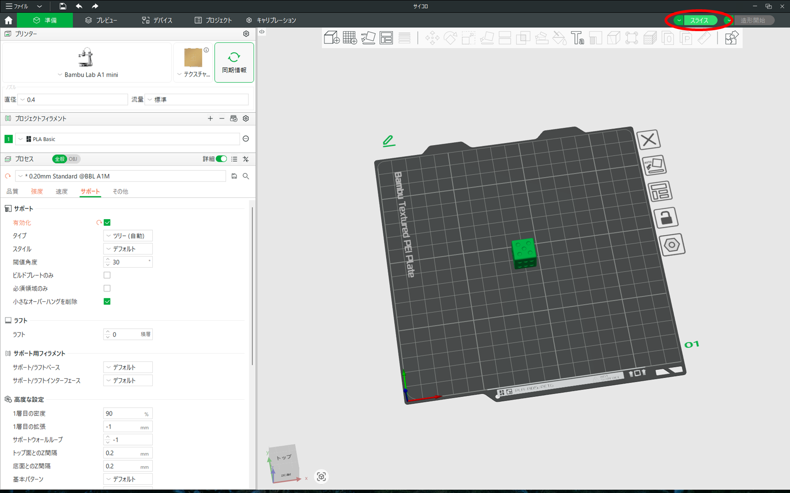
→3DプリンタについているICチップをUSBにさす。
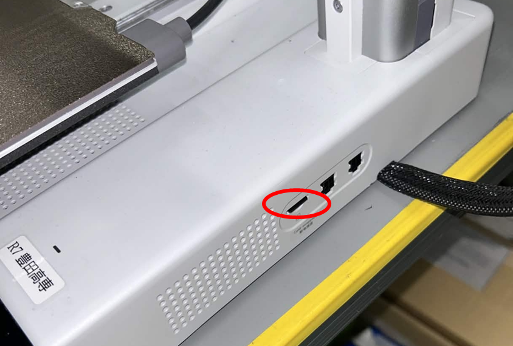
（↑を↓にさしこむ）
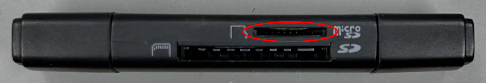
→USBを挿したのち、エクスポートをクリック。
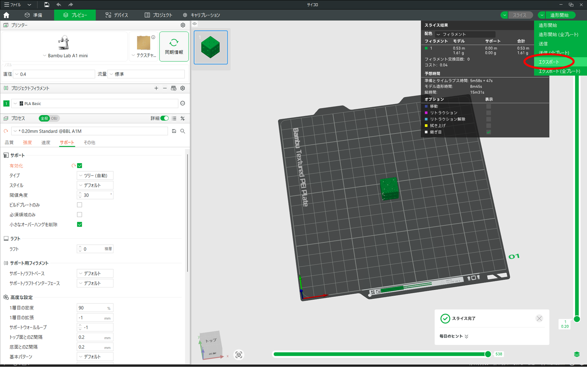
→USBにデータを入れる。

## 印刷（A1mini編）
USBのICチップをA1miniに入れて印刷するデータを選択し、印刷